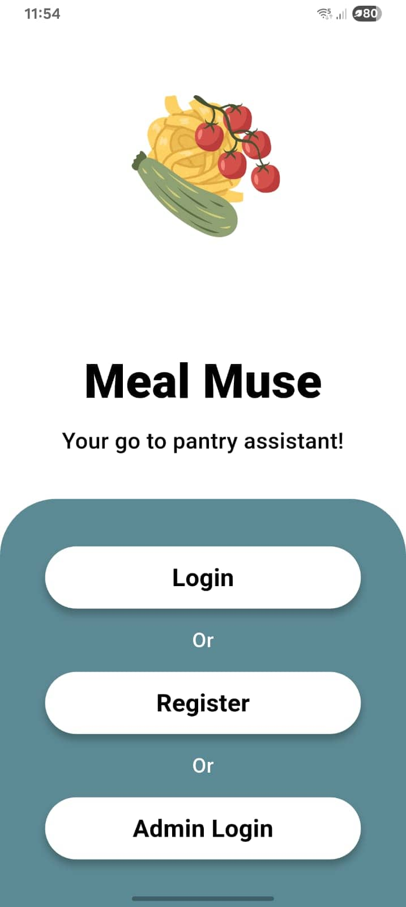
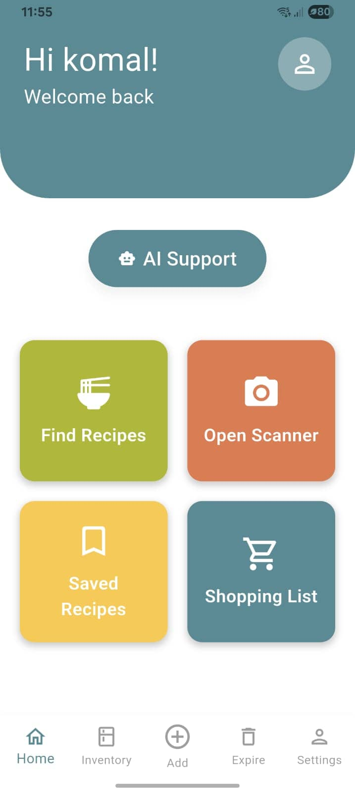
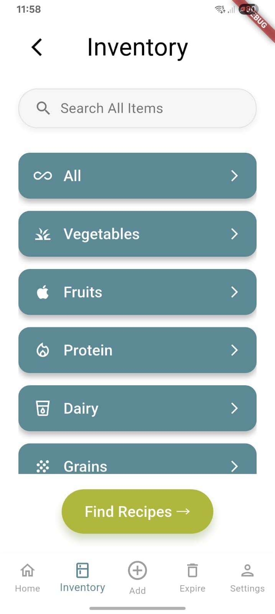
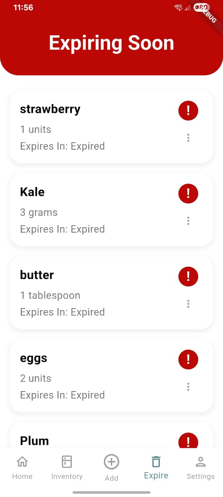
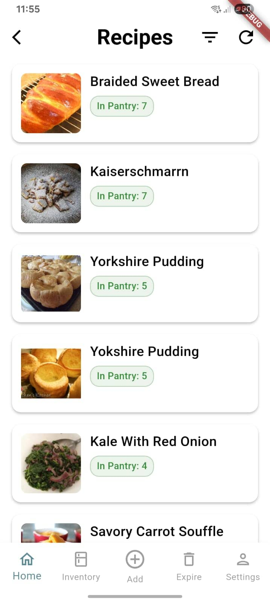
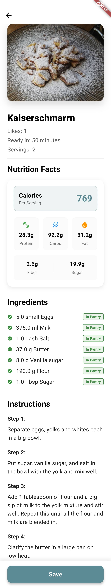
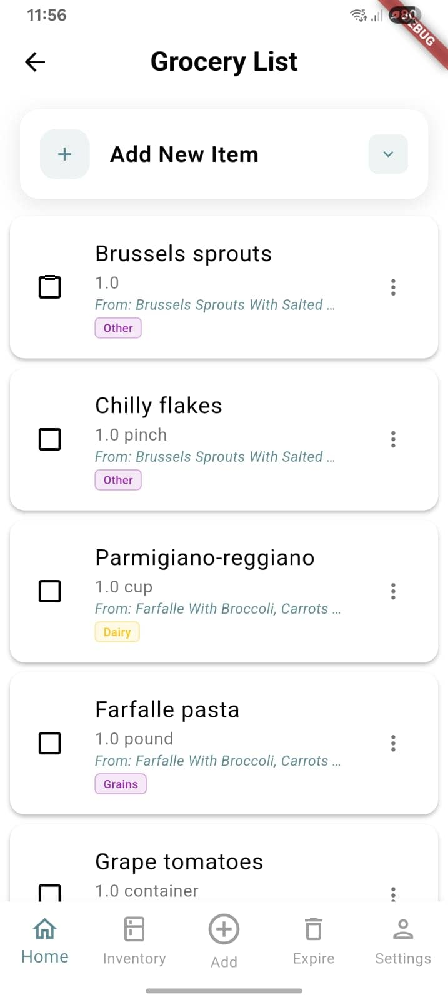
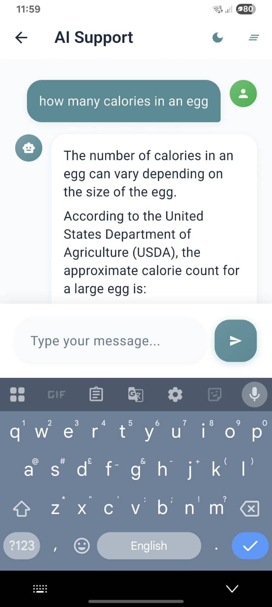
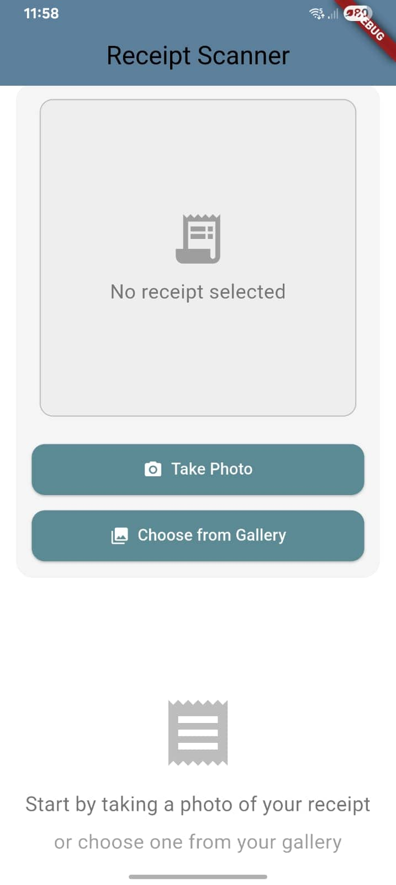

# MealMuse

  <strong>Transform household ingredients into personalized meal solutions</strong>

## 🍽️ Overview

MealMuse is a full-featured recipe discovery application that transforms household ingredients into personalized meal solutions. The app intelligently manages your food inventory, sends expiry alerts, and finds recipes tailored to your available ingredients and dietary restrictions. Designed to reduce food waste and simplify meal planning, MealMuse offers comprehensive digital kitchen management with a beautiful, theme-aware interface.

## 📸 Application Screenshots

### 🏠 Home & Navigation

  
  
  

*Main application interface showing dashboard, navigation, and inventory management*

### 📦 Inventory & Item Management

  
  

*Add new items to your inventory and track items nearing expiry date*

### 🍳 Recipe Features

  
  

*Browse and view detailed recipes with ingredients and instructions*

### 🛒 Shopping & AI Features

  
  

*Manage shopping lists and interact with AI culinary assistant*

### 📄 Smart Features

  

*Scan receipts to automatically add items to your inventory*

## ✨ Key Features

### 🗃️ Inventory Management
- **Add Inventory Items** - Add items with units, category, purchase date, expiry date, and notes
- **Edit Inventory Items** - Modify any field of existing items
- **Remove Inventory Items** - Delete items from inventory
- **Expiry Tracking** - Notifications for items expiring soon
- **Expiring Soon Screen** - View items nearing expiry
- **Receipt Scanning** - Scan receipts to automatically extract items and add to inventory

### 🍳 Recipe Discovery
- **Intelligent Recipe Finder** - Discover recipes using your available inventory items
- **Dietary Filtering** - Filter recipes based on intolerances or dietary restrictions
- **Recipe Saving** - Save favorite recipes for later use
- **Missing Ingredients** - Automatically identify missing recipe ingredients

### 🛒 Shopping List System
- **Add Missing Items** - Move missing recipe ingredients to shopping list
- **Manual Additions** - Add custom items to shopping list
- **Remove Items** - Delete items from shopping list
- **Inventory Integration** - Convert purchased items directly into inventory items

### 🤖 AI Assistance
- **AI-Powered Chatbot** - Get culinary assistance and recipe suggestions using Grok API
- **Smart Recommendations** - Receive personalized meal recommendations

### 👥 User Management
- **User Registration & Login** - Create and access accounts
- **Password Management** - Change password, reset/forgot password via email
- **Profile Customization** - Update username and preferences
- **Admin Controls** - Admin users can manage users and data
- **Logout** - Secure sign out functionality

### 🎨 User Experience
- **Dark/Light Mode** - Switch between themes for comfortable viewing
- **Cross-Platform** - Built with Flutter for seamless Android experience
- **Language Support** - Multi-language interface (Language change feature in progress)

## 🛠️ Technology Stack

- **Framework**: Flutter (Dart)
- **Platform**: Android (Cross-platform ready)
- **Backend**: Firebase
  - Authentication
  - Cloud Firestore/Realtime Database
  - Cloud Storage
- **APIs**:
  - Spoonacular API (Recipe data)
  - Grok API (AI chatbot)
- **Development Tools**: Android Studio
- **Additional Features**: Receipt scanning, push notifications

